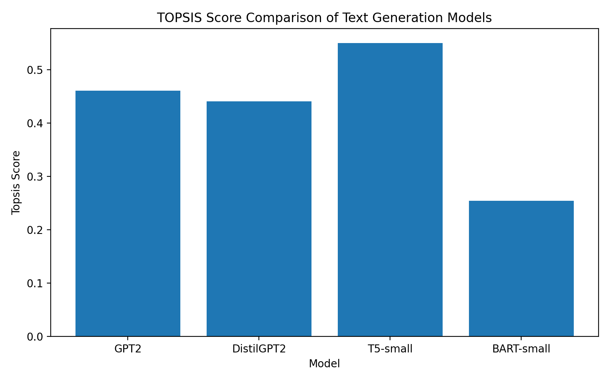
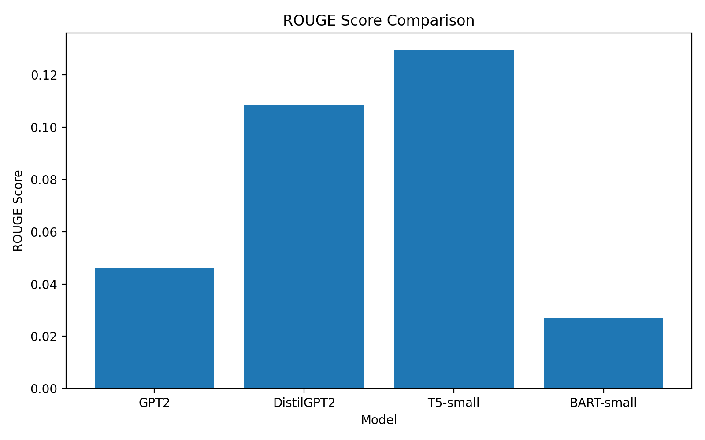

# TOPSIS for Selecting Best Pre-trained Text Generation Model

## 📌 Assignment

Apply **TOPSIS** to find the **best pre-trained model** for:

- Text Summarization (Roll Numbers ending with 0 or 5)  
- ✅ **Text Generation (Roll Numbers ending with 1 or 6)**  
- Text Classification (Roll Numbers ending with 2 or 7)  
- Text Sentence Similarity (Roll Numbers ending with 3 or 8)  
- Text Conversational (Roll Numbers ending with 4 or 9)  

> My roll number ends with **6**, so this project focuses on **Text Generation**.

---

## 📖 Problem Statement

The goal of this project is to **select the best pre-trained text generation model** using the **TOPSIS (Technique for Order Preference by Similarity to Ideal Solution)** multi-criteria decision-making method.

We compare multiple pre-trained models based on the following criteria:

- **BLEU Score** (higher is better)
- **ROUGE Score** (higher is better)
- **Generation Time** (lower is better)
- **Output Length** (lower is better)

---

## 🤖 Models Compared

- GPT2  
- DistilGPT2  
- T5-small  
- BART-small  

---

## 🧪 Evaluation Pipeline

All experiments were performed in `evaluation(2).ipynb`:

1. Each model is given the same prompts
2. Text is generated
3. Metrics are computed:
   - BLEU
   - ROUGE
   - Time taken
   - Output length
4. Results are stored in `raw_results.csv`
5. TOPSIS is applied using `topsis_part1.py`
6. Final results are stored in `final_result.csv`

---

## 📊 Table 1: Raw Results (Before TOPSIS)

This table contains the **actual measured performance** of each model:

📄 File: `raw_results.csv`

---

## 🏆 Table 2: Final Results (After TOPSIS)

This table contains:

- Normalized scores
- TOPSIS Score
- Final Rank

📄 File: `final_result.csv`

---

## 📈 Graphs and Visualizations

### 1️⃣ TOPSIS Score Comparison

---

### 2️⃣ Time Comparison

---

### 3️⃣ ROUGE Score Comparison

---

## 🥇 Final Ranking (Based on TOPSIS)

| Rank | Model |
|------|--------|
| 1️⃣ | **T5-small** |
| 2️⃣ | GPT2 |
| 3️⃣ | DistilGPT2 |
| 4️⃣ | BART-small |

---

## 🧠 Conclusion

Based on the TOPSIS evaluation using multiple criteria (BLEU, ROUGE, Time, and Length), **T5-small** achieved the highest TOPSIS score and is therefore selected as the **best overall pre-trained text generation model** among the evaluated models.

---

